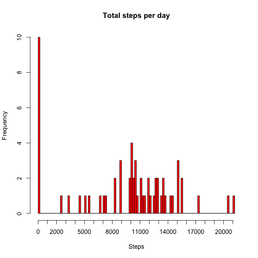
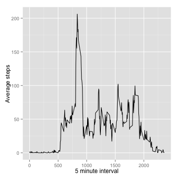
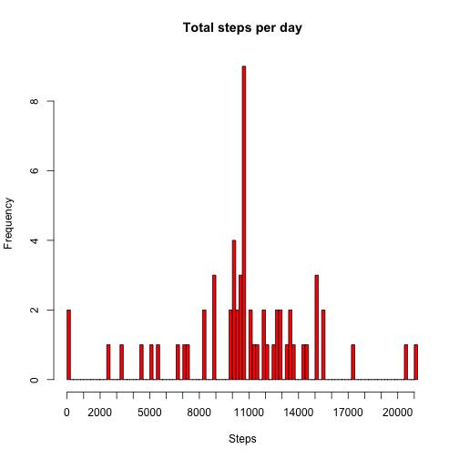
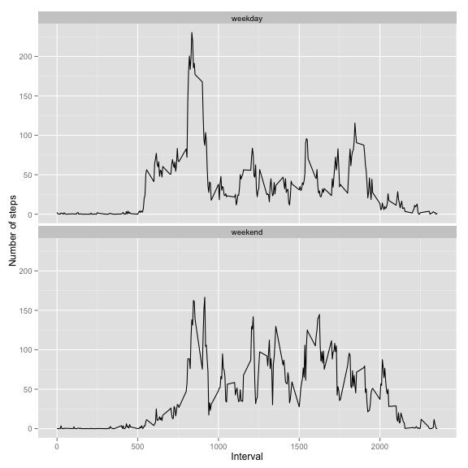

# Reproducible Research: Peer Assessment 1
Peer Assessment 1 requirement is to load activity data and answer the following questions using the data  
Variables included are:
- steps: Number of steps taking in a 5-minute interval (missing values are coded as NA)
- date: The date on which the measurement was taken in YYYY-MM-DD format
- interval: Identifier for the 5-minute interval in which measurement was taken

There are a total of 17,568 observations in this dataset.

## Loading and preprocessing the data

- Data is loaded using read.csv function

```r
library(ggplot2)
activity <- read.csv("activity.csv")
activity$date <- as.Date(activity$date, "%Y-%m-%d")
```

- Aggregate data to calculate the mean total number of steps taken per day

```r
steps <- aggregate(activity$steps, by = list(activity$date), FUN = sum, na.rm = TRUE)
```


## What is mean total number of steps taken per day?
*Note: NA values are ignored for this analysis*
- Histogram of the total number of steps taken each day

```r
xrange <- range(steps$x, na.rm = TRUE)
hist(steps$x, col = "red", breaks = 100, xlim = xrange, main = "Total steps per day", 
    xaxt = "n", xlab = "Steps")
axis(1, at = seq(0, xrange[2], by = 1000), labels = seq(0, xrange[2], by = 1000))
```

 

- Mean and median total number of steps taken per day

```r
mean(steps$x)
```

```
## [1] 9354
```

```r
median(steps$x)
```

```
## [1] 10395
```


## What is the average daily activity pattern?

- Time series plot (i.e. type = "l") of the 5-minute interval (x-axis) and the average number of steps taken, averaged across all days (y-axis)

```r
interval_aggregate <- aggregate(activity$steps, by = list(activity$interval), 
    na.rm = TRUE, FUN = mean)
ggplot(interval_aggregate, aes(Group.1, x)) + geom_line() + xlab("5 minute interval") + 
    ylab("Average steps")
```

 

- Which 5-minute interval, on average across all the days in the dataset, contains the maximum number of steps?

```r
interval_aggregate[which(interval_aggregate$x == max(interval_aggregate$x)), 
    "Group.1"]
```

```
## [1] 835
```


## Imputing missing values
*Note that there are a number of days/intervals where there are missing values (coded as NA). The presence of missing days may introduce bias into some calculations or summaries of the data.*

- Calculate and report the total number of missing values in the dataset (i.e. the total number of rows with NAs)

```r
nrow(activity[is.na(activity$steps), ])
```

```
## [1] 2304
```

- Replacement strategy for filling in all of the missing values in the dataset - mean for that 5-minute interval is used in this case

```r
## Add a column with the mean for that 5 minute interval
activity$mean_interval <- sapply(activity[, 3], function(x) interval_aggregate[which(x == 
    interval_aggregate$Group.1), "x"])
```

- Create a new dataset that is equal to the original dataset but with the missing data filled in.

```r
activity_noNA <- activity
activity_noNA <- transform(activity_noNA, steps = ifelse(is.na(steps), mean_interval, 
    steps))
## remove the mean interval column since we already integrated the mean to
## the NA values
activity_noNA <- within(activity_noNA, rm(mean_interval))
```


- Make a histogram of the total number of steps taken each day and Calculate and report the mean and median total number of steps taken per day. Do these values differ from the estimates from the first part of the assignment? What is the impact of imputing missing data on the estimates of the total daily number of steps?

```r
steps_noNA <- aggregate(activity_noNA$steps, by = list(activity_noNA$date), 
    FUN = sum)
xrange <- range(steps_noNA$x, na.rm = TRUE)
hist(steps_noNA$x, col = "red", breaks = 100, xlim = xrange, main = "Total steps per day", 
    xaxt = "n", xlab = "Steps")
axis(1, at = seq(0, xrange[2], by = 1000), labels = seq(0, xrange[2], by = 1000))
```

 

```r
mean(steps_noNA$x)
```

```
## [1] 10766
```

```r
median(steps_noNA$x)
```

```
## [1] 10766
```

Mean and Median values differ since data distribution changed with inclusion of NA rows.


## Are there differences in activity patterns between weekdays and weekends?

- Create a new factor variable in the dataset with two levels – “weekday” and “weekend” indicating whether a given date is a weekday or weekend day.

```r
activity_noNA <- transform(activity_noNA, week_val = ifelse((weekdays(activity_noNA$date, 
    TRUE) %in% c("Sat", "Sun")), "weekend", "weekday"))
interval_aggregate_wk <- aggregate(activity_noNA$steps, by = list(activity_noNA$interval, 
    activity_noNA$week_val), na.rm = TRUE, FUN = mean)
```


- Make a panel plot containing a time series plot (i.e. type = "l") of the 5-minute interval (x-axis) and the average number of steps taken, averaged across all weekday days or weekend days (y-axis). 

```r
p <- ggplot(interval_aggregate_wk, aes(Group.1, x)) + geom_line() + xlab("Interval") + 
    ylab("Number of steps")
p <- p + facet_wrap(~Group.2, ncol = 1)
print(p)
```

 

- Mean of weekday steps vs weekend steps

```r
interval_aggregate_wk_day <- interval_aggregate_wk[interval_aggregate_wk$Group.2 == 
    "weekday", ]
interval_aggregate_wk_end <- interval_aggregate_wk[interval_aggregate_wk$Group.2 == 
    "weekend", ]
mean(interval_aggregate_wk_day$x)
```

```
## [1] 35.61
```

```r
mean(interval_aggregate_wk_end$x)
```

```
## [1] 42.37
```


